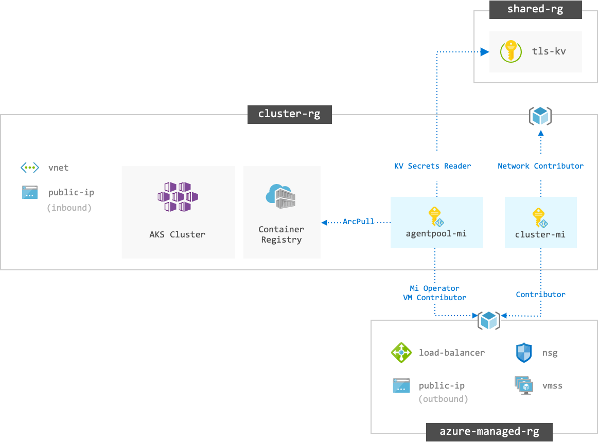

# cloudkube.io - AKS Clusters

An opinionated Azure Kubernetes Service (AKS) cluster for running demo apps, leveraging `Makefile` instead of lots of bash-fu to install AKS add-ons.


## TL;DR; (Deploy)

Because I'm too impatient to read, I created a [`workflow.makefile`](./workflow.makefile). The commands below refer to the `dev` environment. To target staging, just replace suffixes with `staging`.

#### Part 1

Run Terraform - and remember to review `plan` before `apply`.

```bash
make -f workflow.makefile init-dev
make -f workflow.makefile plan-dev
make -f workflow.makefile apply-dev
```

#### Part 2

Go to [julie-ng/cloudkube-shared-infra](https://github.com/julie-ng/cloudkube-shared-infra) repo, take cluster suffix, e.g. `p7vm` and update `terraform.tfvars` in  and run that infra as code.

#### Part 3

Come back here (this repo) and install ingress controller, pull TLS certs from key vault and deploy a hello world app.

```bash
make kubecontext
make setup
```

See full commands and explanations below.

## Architecture

The following diagram illustrates the Azure solution architecture for _each cluster_, e.g. dev, staging and prod.



### Architecture Decisions

#### Networking

- Virtual Network integration
- Azure CNI Networking
- [NGINX Ingress Controller](https://kubernetes.github.io/ingress-nginx/)

#### Identity & Security

- [AKS Managed Microsoft Entra ID Integration](https://learn.microsoft.com/en-us/azure/aks/enable-authentication-microsoft-entra-id)
  - [Disable Kubernetes Local Accounts](https://learn.microsoft.com/en-us/azure/aks/manage-local-accounts-managed-azure-ad#disable-local-accounts)
- [Azure Key Vault Provider for Secrets Store CSI Driver](https://azure.github.io/secrets-store-csi-driver-provider-azure/)

#### Miscellaneous

- Prefer `-managed-rg` suffix over default `MC_` prefix for resource group containing managed cluster

### Managed Identities - Control Plane vs Kubelet

| Managed Identity | Security Principal | Details |
|:--|:--|:--|
| `control-plane-mi` | AKS Control Plane | Interfaces with ARM to manage cluster resources, VMs, networking, etc. | 
| `kubelet-mi` | K8s Node Agent | Needs some access e.g. Container Registry and Key Vault to setup workloads. |

### Environments 

Resources names will include one of

- `dev`
- `staging`
- ~~`prod`~~ (currently not used)

### Hosts

- [dev.cloudkube.io](https://dev.cloudkube.io)
- [staging.cloudkube.io](https://staging.cloudkube.io)
- [cloudkube.io](https://cloudkube.io)

# Setup and Configure 

Using Terraform and make commands, you will have an AKS cluster with all the Azure CSI and Pod Identity Add-Ons up and running with just 5 commands.

## Requirements

### CLI Tools (Required)

In order to deploy AKS clusters using IaC in this repository, you will need the following command line tools:

- [terraform](https://www.terraform.io/docs/cli/index.html)
- [kubectl](https://kubernetes.io/docs/tasks/tools/)
- [helm 3](https://helm.sh/)
- [make](https://www.gnu.org/software/make/)
- [envsubst](https://www.gnu.org/software/gettext/manual/html_node/envsubst-Invocation.html)  
  Install on a mac
	```bash
	brew install gettext
	brew link --force gettext
	```
  Install on Ubuntu
	```bash
	apt-get install gettext-base
	```

### Shared Infrastructure (Required)

The following Azure resources are located in a separate Resource Group `cloudkube-shared-rg` and managed by the [`cloudkube-shared-infra`](https://github.com/julie-ng/cloudkube-shared-infra) repository:

- DNS Records
- Key Vaults
- Role Assignments to access TLS Certificates

Without these resources, the setup of the Ingress controller will fail as it wants to configure TLS encryption.

### Storage Accounts for Terraform State Files (Optional)

This is not necessary if you just want to deploy and manage a single cluster from your local machine. In cloudkube.io use case, this infrastructure as code (IaC) repo is used to manage 3 distinct AKS clusters and will be integrated with CI/CD. 

And to comply with governance best practices, we have 2 different storage accounts to create a security boundary between production and non-production resources.

[](./backends/README.md)

_Diagram: use different Storage Accounts for RBAC on Terraform State. See [backends/README.md](./backends/README.md) for details._

## Deployment 

### terraform init

First initialize the remote backend and specify which environment, e.g. `backends/dev.backend.hcl`

```bash
terraform init -backend-config=backends/dev.backend.hcl
```

If you dont' want to deal with remote and multiple environments, you can leave out the `-backend-config` flag.

### terraform plan

Now create a infrastructure plan. Specify environment configuration with `var-file` flag pointing to e.g. `environments/dev.tfvars`

```bash
terraform plan -var-file=environments/dev.tfvars -out plan.tfplan
```

### terraform apply

If you are satisified with the plan, deploy it

```bash
terraform apply plan.tfplan
```

## Re-configure Shared Infra

If the cluster is a re-created, go to [julie-ng/cloudkube-shared-infra](https://github.com/julie-ng/cloudkube-shared-infra) and run the infra as code there to

- update DNS records to new Static IP
- update RBAC Assignments to Key Vault that holds TLS certificates. Otherwise ingress controller deployment will fail.

When that runs, come back here.

## Setup Ingress Controller

Finally finish cluster setup with

```bash
make kubecontext
make setup
```

which will
- install Azure CSI driver
- setup namespaces
- install nginx ingress controller
- setup and configure "hello world" app
- configure TLS by pull certificates from shared Key Vault

See [Makefile](./Makefile) for details.

# Cluster Upgrades

If an upgrade (e.g. enable Azure RBAC) requires Terraform to destroy and re-create the cluster, then additional steps are required after `terraform apply`

- re-setup with `make setup` was required
- re-setup access to TLS certificates for ingress
  - the managed identities for kubelet and ingress change, which requires re-deploying [cloudkube-shared-infra](https://github.com/julie-ng/cloudkube-shared-infra).
  - then finish setup by re-running failed step `make apply-hello`

# Miscellaneous

### Update Change log

To update [CHANGELOG.md](./CHANGELOG.md) with [standard-version](https://github.com/conventional-changelog/standard-version) run

```bash
standard-version --packageFiles manifest.json --sign --release-as minor
```

then adjust as needed by hand and commit.

# References

Official Documentation

### Terraform

- [Terraform Docs - Organizing Multiple Environments for a Configuration](https://www.terraform.io/docs/cloud/workspaces/configurations.html#organizing-multiple-environments-for-a-configuration)
- [Terraform Docs - When to use Multiple Workspaces](https://www.terraform.io/docs/language/state/workspaces.html#when-to-use-multiple-workspaces)
- [Terraform Docs - Variable Definition Precedence](https://www.terraform.io/docs/language/values/variables.html#variable-definition-precedence)

### Azure

- Azure AD RBAC
  - [Built-in Roles for Azure Key Vault](https://learn.microsoft.com/en-us/azure/key-vault/general/rbac-guide?tabs=azure-cli#azure-built-in-roles-for-key-vault-data-plane-operations)
  - [Built-in Roles for Kubernetes Authorization](https://learn.microsoft.com/en-us/azure/aks/concepts-identity#built-in-roles)
- [Azure Kubernetes Service - Summary of Managed Identities](https://docs.microsoft.com/azure/aks/use-managed-identity#summary-of-managed-identities)
- **[Azure AD Workload Identity with AKS](https://learn.microsoft.com/en-us/azure/aks/workload-identity-overview)**
- **[Azure CSI](https://azure.github.io/secrets-store-csi-driver-provider-azure/)**
	- [Standard Walkthrough](https://azure.github.io/secrets-store-csi-driver-provider-azure/demos/standard-walkthrough/)
	- [Enable NGINX Ingress Controller with TLS](https://azure.github.io/secrets-store-csi-driver-provider-azure/docs/configurations/ingress-tls/)

### Nginx Ingress Controller

- [Kubernetes Docs - NGINX Ingress Controller](https://kubernetes.github.io/ingress-nginx)
- [Helm Chart](https://artifacthub.io/packages/helm/ingress-nginx/ingress-nginx) on Artifact Hub
- [Helm Chart Source](https://github.com/kubernetes/ingress-nginx) on GitHub.com
  - [values.yaml](https://github.com/kubernetes/ingress-nginx/blob/master/charts/ingress-nginx/values.yaml)
